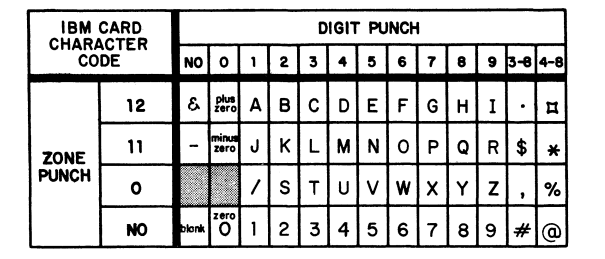
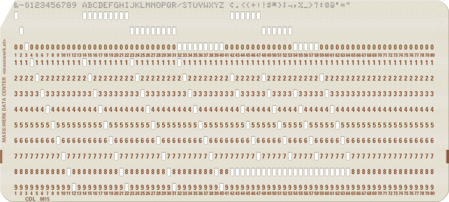

# 1401cs

project to learn old computor and cpp

## info 

## sources

[ibm 1401 info](https://ibm-1401.info/)

[programming reference Symbolic_Programming_System_Student_Materials](http://www.bitsavers.org/pdf/ibm/1401/R29-0044-2_1401_Symbolic_Programming_System_Student_Materials.pdf)

